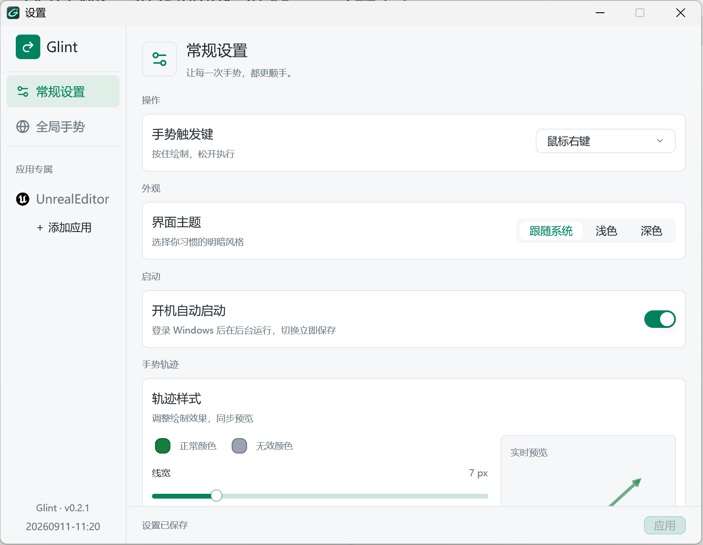
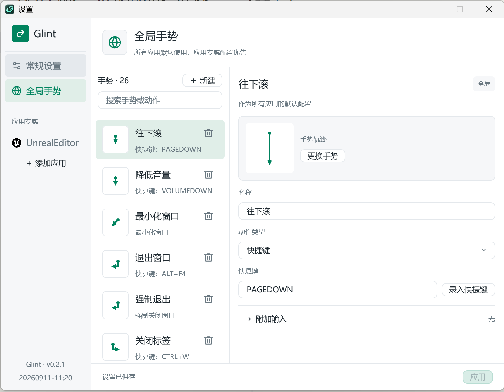
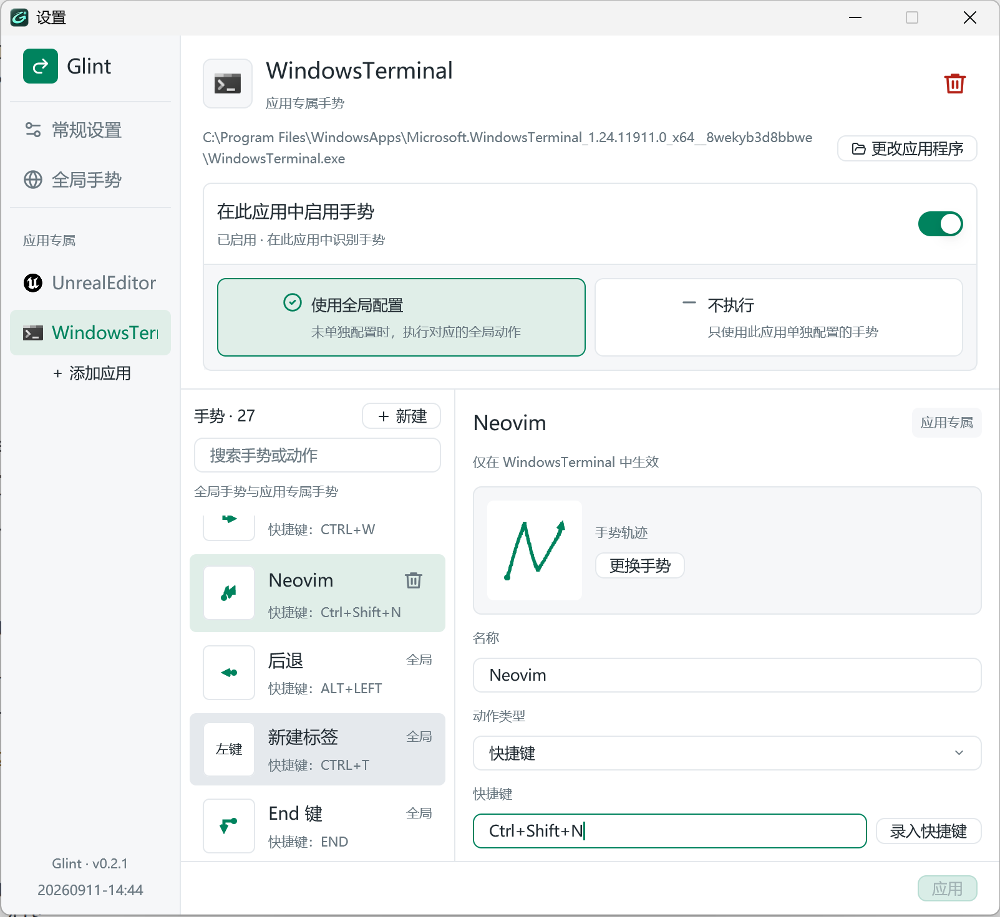
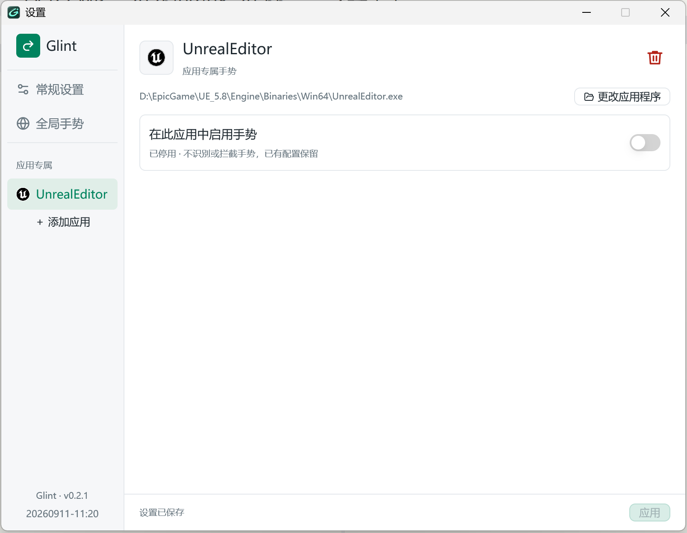

# Glint · 掠影

**划过，即行动。** 使用 Rust 和 GPUI 从头构建的 Windows 鼠标手势工具。

按住右键划出轨迹，松开后执行动作。短按右键仍是普通右键点击。后台与设置窗口是独立进程，关闭设置不会停止手势。

## 启动

运行 `dist/Glint-v0.2.3-windows-x64-setup.exe` 安装后，可从开始菜单打开 Glint。安装仅针对当前用户，默认目录为 `%LOCALAPPDATA%\Programs\Glint`，可选创建桌面快捷方式；可从 Windows“已安装的应用”卸载。升级及卸载保留 `%APPDATA%\Glint` 中的配置，卸载会清理指向本安装目录的开机启动项。

从 `dist/Glint` 双击 **`glint-settings.exe`**。设置程序会自动启动同目录的 `glint.exe`。也可以只运行后台，通过托盘菜单打开设置、暂停、重载或退出。

配置默认存放在 `%APPDATA%\Glint`，首次启动自动创建。无需安装 .NET。开机启动默认关闭，可在“常规 → 启动”中开启，切换立即保存；登录 Windows 后使用当前配置在后台运行，不弹出设置窗口。

首版面向 Windows 10/11 x64 桌面。GPUI 设置界面需要支持 DirectX 11 的显卡和可用驱动。高权限应用需要 Glint 以相同权限运行；Windows 不允许普通权限程序向管理员窗口注入输入。安全桌面、独占全屏和所有多屏硬件组合不在自动测试覆盖范围内。

如果在任务管理器或以管理员身份运行的终端等窗口中无法使用手势，右键 Glint 托盘图标，选择“以管理员权限重启”，并确认 Windows UAC 提示。后台使用原配置目录重新启动；取消授权会保留原后台。此操作仅对本次运行生效，不改变开机启动设置。已提权时不再显示该菜单项。从提权后台打开的设置和手势启动的程序也会继承管理员权限。

## 功能

- 28 个内置轨迹模板，按方向匹配；界面录制使用新 ID，避免修改其他绑定共享的模板。
- 全局手势与应用专属手势；应用按完整程序路径匹配，可继承全局、仅使用专属或整应用禁用。JSON 动作包支持正则过滤。
- 五个鼠标触发键可选；手势期间支持滚轮、其他按钮点击及按键痕迹。
- 快捷键、窗口操作和启动程序。
- 可调整轨迹颜色、粗细和透明度；原生透明覆盖窗不抢焦点。
- GPUI 设置界面：常规设置、全局与应用标签，以及统一的手势列表和动作编辑区。
- 紧凑设置布局；浅色、深色、跟随 Windows 三种外观模式，主题选择自动保存，跟随模式随系统应用主题变化。
- 专属 Glint 图标，内嵌于程序文件、设置窗口和系统托盘。
- 临时暂停时托盘切换为银灰色、金色暂停标记的图标；恢复后自动切回绿色，悬停提示同步更新。
- 配置热重载；无效修改保留上一份有效配置并显示错误。
- 托盘控制、独立后台、命名管道 IPC 和滚动日志。

## 设置窗口

### 常规设置：调整操作与外观

在“常规设置”中选择手势触发键、浅色或深色主题，设置开机启动，并调整轨迹颜色、粗细和透明度，通过预览查看绘制效果。



常规页还可调整日志级别、直接打开日志文件，高级选项提供配置目录入口。版本号显示在左下角，下方居中显示构建时间（`YYYYMMDD-HH:mm`，构建机器本地时间）。

### 全局手势：把轨迹绑定到常用动作

在左侧列表选择手势，右侧即可编辑名称、轨迹和动作。支持选择或录制轨迹、录入并确认快捷键，也可配置窗口操作或启动程序。“附加输入”可组合鼠标按钮点击和滚轮方向。



上图将向下轨迹绑定到 PageDown，用于向下翻页。全局配置作为各应用的默认手势，应用专属配置优先。

### 应用专属：按应用定制或停用手势

添加应用时，可选择程序或拾取窗口取得完整的 `.exe` 路径。应用标签显示应用自身图标，无法获取时使用默认图标；路径右侧的“更改应用程序”可替换程序并保留手势配置。

启用应用手势后，可为该应用添加专属动作，并为未单独配置的手势选择“使用全局配置”或“不执行”。选择“使用全局配置”时，列表同时展示全局手势与应用专属手势，方便在通用操作的基础上按需定制。



上图在 WindowsTerminal 中添加了名为“Neovim”的专属手势，将 N 形轨迹绑定到 `Ctrl+Shift+N`，仅在该应用中生效；其他未单独配置的手势继续使用全局动作。此处为自定义配置示例，快捷键的具体效果取决于目标应用的设置。



上图以 UnrealEditor 为例，在该应用中停用手势后，Glint 不识别或拦截手势，已有配置仍会保留。停用会隐藏策略及编辑区，并在捕获手势前放行鼠标输入。标题右侧的删除图标需确认后才会移除应用配置，随后恢复全局手势。

点击“拾取窗口”后，设置界面暂时隐藏，鼠标变为十字光标；左键点击目标窗口即可恢复设置界面并填入应用名称和程序路径。按 Esc 或等待 60 秒可取消拾取，保留原有输入。

### 保存与生效

设置修改后需手动点击右下角“应用”，才提交当前页面或当前应用作用域的修改并生效。切换标签会保留草稿，其他标签的草稿不会随当前页一起提交；无效输入会保留在编辑区供修正，关闭窗口时若仍有未保存修改，会提示是否放弃。主题选择和开机启动开关即时保存。侧栏的“常规设置”和“全局手势”以上下分隔线组成全局配置区域。也可从界面打开配置目录编辑 JSON 基础配置。

## 默认手势

默认全局绑定以用户提供的 WGesture2 手势表为基础，并增加音量调节，共 26 条。先按住右键；箭头按顺序划动，斜箭头为直线。

| 轨迹 | 动作 | 轨迹 | 动作 |
|---|---|---|---|
| ← | 后退 | → | 前进 |
| ↑ | PageUp 翻页 | ↓ | PageDown 翻页 |
| ↑ 后滚轮向上 | 增大系统音量 | ↓ 后滚轮向下 | 降低系统音量 |
| ↑↓ | F5 刷新 | →↓ 后点左键 | 恢复关闭的标签 |
| →↓ | 新建标签 | ↓→ | 关闭标签 |
| ↓← | Alt+F4 退出窗口 | ↓← 后点左键 | 强制结束目标进程 |
| ↙ | 最小化窗口 | ↗ | 切换最大化／还原 |
| ↑→↑ | 切换置顶 | ↑→↓← | PrintScreen 截图 |
| ↑← | 上一标签 | ↑→ | 下一标签 |
| ←↑ | Home | ←↓ | End |
| ←→ | Backspace | →← | Delete |
| 滚轮向上 | 上一标签 | 滚轮向下 | 下一标签 |
| 点击左键（无划动） | 新建标签，按下即执行 | ↗ 后点左键 | F11 全屏 |

默认只包含全局动作包，资源管理器也使用上述绑定。组合手势在附加按钮按下或滚轮滚动时执行，松开右键不再执行原轨迹动作。音量手势可保持按住右键，继续滚轮重复调节。可在“全局手势”中查看和编辑绑定，“附加输入”支持按钮点击和滚轮方向。

表外的手势没有加入默认绑定。完整绑定可见 [预置配置](config/config.json)。已有用户配置不会被新预置自动覆盖。

## 配置

| 文件 | 用途 |
|---|---|
| `config.json` | 基本设置、匹配规则和动作绑定 |
| `gestures.json` | 录制轨迹；界面使用新 ID，手动写入同 ID 时覆盖基础模板 |
| `overrides.json` | 界面保存的偏好、应用元数据及按作用域/动作 ID 合并的修改和删除记录 |
| `settings.json` | 设置窗口的外观主题，独立于手势配置 |
| `glint.log` / `glint-settings.log` | 后台 / 设置窗口日志，分别超过 1 MiB 后轮换为 `*.previous.log` |
| `startup-error.log` | 无控制台时保留启动错误 |

界面保存的同名偏好、应用和动作优先于 JSON 基础定义；未覆盖的动作仍随基础配置修改生效。保存时校验完整配置，失败保留原配置。录制新轨迹后还需应用对应绑定，不会改写共享模板。识别只比较当前进程和当前事件类型的有效绑定轨迹，其他应用或未绑定的录制不会抢占识别；同分时应用专属优先于全局。完整格式与例子见 [JSON 配置指南](docs/config.md)。日志使用标准 `log` crate 写入配置目录中的 `glint.log`，默认级别为 `info`；执行的动作记为 `debug`，可在常规设置中调整级别并立即生效。

```json
{
  "stroke_button": "right",
  "logging": { "level": "info" },
  "packages": [
    {
      "id": "global", "name": "通用", "match": [".*"],
      "actions": [
        {
          "id": "copy", "name": "复制", "gesture": "up",
          "action": { "type": "keys", "keys": "CTRL+C" }
        }
      ]
    }
  ]
}
```

## 开发

需要 Rust MSVC 工具链、Visual Studio 的“使用 C++ 的桌面开发”组件以及 Windows SDK。当前构建环境为 Rust 1.98。GPUI 与组件库固定为已验证的版本，提交 `Cargo.lock` 保证依赖可复现。

Windows x64 构建通过 `.cargo/config.toml` 使用 Rust 工具链自带的 LLD 链接器，无需另外安装 LLVM。首次切换链接器会重新编译依赖；日常开发使用 `cargo build --workspace`。发布构建使用 `opt-level = 3`、Fat LTO、单个 codegen unit，并关闭增量编译，优先优化运行性能，代价是更长的编译时间和更高的构建内存占用。可用 `cargo build --workspace --timings` 查看各阶段耗时。

```powershell
cargo test -p glint-core -p glint-platform -p glint-ipc -p glint
cargo clippy --workspace --all-targets -- -D warnings
cargo build --workspace --release --locked
pwsh -File scripts/package.ps1
```

### 制作 Windows 安装包

安装 [Inno Setup 6](https://jrsoftware.org/isdl.php)，然后运行：

```powershell
pwsh -NoProfile -File scripts/build-installer.ps1
# 复用本脚本已构建的 x64 release 程序：
pwsh -NoProfile -File scripts/build-installer.ps1 -SkipBuild
# 编译器不在标准位置时：
pwsh -NoProfile -File scripts/build-installer.ps1 -IsccPath 'C:\Tools\Inno Setup 6\ISCC.exe'
```

脚本从 Cargo 元数据读取版本，使用 `--locked --target x86_64-pc-windows-msvc` 构建，输出 `dist/Glint-v<版本>-windows-x64-setup.exe` 和对应 `.sha256` 校验文件。安装包面向 Windows 10 1903 及以上 / Windows 11，包含两个程序、文档以及 Visual C++ x64 运行库。运行库默认从 Visual Studio 的 `VC\Redist\MSVC` 目录发现，也可使用 `-RuntimeDirectory` 指定其中的 `x64\Microsoft.VC*.CRT` 目录；更新安装包时应同步更新该运行库。安装包未进行代码签名。

升级、卸载前请通过托盘菜单退出 Glint（含以管理员权限运行的后台），避免程序文件被占用；升级时保留原安装路径以继续使用现有开机启动设置。原有 `scripts/package.ps1` 仍用于制作便携 ZIP。

调试运行：

```powershell
# 先构建两个可执行程序，设置程序才能找到旁边的后台。
cargo build --workspace
.\target\debug\glint-settings.exe

# 使用独立配置目录，避免影响日常配置。
.\target\debug\glint.exe --config-dir .\.glint\dev init
.\target\debug\glint.exe --config-dir .\.glint\dev check
.\target\debug\glint.exe --config-dir .\.glint\dev --no-hooks
```

命令行支持 `init`、`check`、`status`、`pause`、`resume`、`reload`、`quit`、`--config-dir PATH`。`GLINT_CONFIG_DIR` 可设置默认目录。`--no-hooks` 仅用于诊断配置与通信，不安装全局输入钩子。`glint-settings --smoke-test` 验证 GPUI 窗口创建后自动退出，不启动后台。

发布版本的两个程序采用 Windows GUI 子系统，不弹控制台；需要查看 CLI 输出时可重定向到文件，或者使用 debug 版本。

## 架构

```text
glint-settings (GPUI)
        │ 本地命名管道
        ▼
glint (控制、配置重载、录制保存、动作队列)
    ├── glint-core       识别、规则、JSON 配置与动作上下文
    ├── glint-platform   Win32 鼠标钩子、轨迹覆盖窗、托盘、原生动作
    └── glint-ipc        版本化消息、实例隔离、有界通信
```

钩子线程同步决定拦截或放行，绘制在独立线程中处理。动作队列有上限，原生动作在专用线程串行执行，不阻塞鼠标钩子。暂停、开始录制或热重载会丢弃尚未开始的旧动作；已进入的原生调用不能强制中断。

## 验证范围

自动测试使用临时目录和 `--no-hooks` 服务进程，覆盖识别、规则优先级、应用路径规范化与继承/禁用、JSON 配置校验、增量覆盖、真实 IPC、重复实例、保存回滚、暂停恢复和热重载。不会向用户应用发送测试快捷键；这些测试不代表完成图形界面的逐项交互验收。

原生输入、界面及硬件验收记录见 [验证记录](docs/verification.md)。

MIT License。
